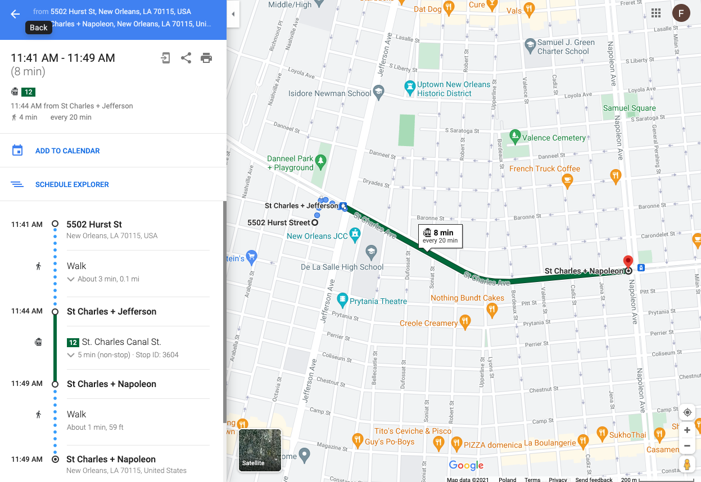
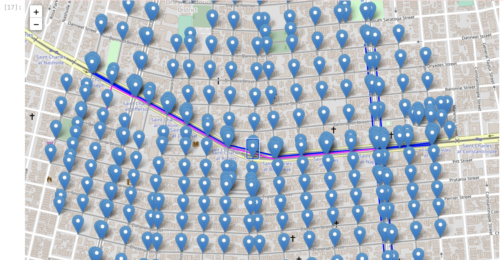

Welcome to Transit + OSMnx's documentation!
===========================================

"Transit + OSMnx"  
by Filip Wodnicki

*Final project submission for:*

Harvard Extension School  
Advanced Python for Data Science (CSCI E-29)   
Spring 2021


### Bottom line: Networks and multimodal routing!

Google Maps                       |  Transit + OSMnx
:--------------------------------:|:-------------------------------------:
  |  

On the left are these google map directions, on the right are the same multi-modal transit directions built with transit + osmnx.

### Project Links
* [Github repo](https://github.com/filipwodnicki/2021sp-final-project-filipwodnicki)  
* [Presentation slides](https://docs.google.com/presentation/d/1L0vrLfTB2FN6hQcsGmyvXr8JFdBoLr_LngKreDsC7mY/edit?usp=sharing)  
* [Presentation video](https://imhere.dcex.harvard.edu/courses/81475) (Section 5 May 2021, 1:30PM EST)  *Harvard Extension access only*
* [Piazza post](https://piazza.com/class/kjnsrz2yddr2si?cid=762)  *Harvard Extension access only*

```{toctree} 
---
maxdepth: 1
caption: Documentation Pages
---
Home <index>
Project demo <Demo>
Code reference <reference>
Discussion - Advanced Python Concepts <adv_py>
```

#### Cool features of this documentation
1. Autodoc  
2. Markdown-based, rather than .rst
3. Parsing ipynb notebooks (using myst-nb library)  

# Transit + OSMnx

## Objective
Build a multi-modal walking and transit network, with Python, open source libraries, and open data.

## Background
The python library [osmnx](https://github.com/gboeing/osmnx) introduced the ability to easily download [OpenStreetMap](https://www.openstreetmap.org/) (OSM) data and build a queryable [networkx](https://networkx.org/) graph of a) road, b) walking, and c) bike path networks for analysis. However, OSM is a limited and incomplete source of data on actual public transport services. In contrast, libraries like [peartree](https://github.com/kuanb/peartree) and pandana create spatio-temporal models of public transport systems based on [GTFS](https://gtfs.org/) schedule data. However, these libraries don’t integrate those public transport models back into the surrounding walking and biking networks, leaving them out of context of the greater urban fabric.

## Approach
1. Explore.  
2. Solve.  
3. Refactor.  

## Deliverables

### Library
See the [Code Reference](./reference.md) and [repo](https://github.com/filipwodnicki/2021sp-final-project-filipwodnicki)

### Demo
See [Demo.ipynb](./Demo.ipynb) where we walk through combining a the walking and transit networks of New Orleans.  

### Basic Usage
```python
from final_project import WalkingNetwork, TransitNetwork, MultiNetwork

W = WalkNetwork.load(NOLA_WALK)
T = TransitNetwork.load(NOLA_TRANSIT)
WT = MultiNetwork.combine(walk=W, transit=T)

m = WT.mapper
m
```

### Installation
```
conda install -r requirements.txt
git clone https://github.com/csci-e-29/2021sp-final-project-filipwodnicki.git
```


## Architecture


## Advanced Python
See the writeup on concepts used [here](./adv_py.md).

## Conclusion

---

## Future
But it's not the end! Here are some ideas for next steps:
* Contribution to osmnx or Peartree
* Scale via Luigi and Dask


### References

1. [osmnx](https://github.com/gboeing/osmnx)  
2. [OpenStreetMap](https://www.openstreetmap.org/)  
3. [networkx](https://networkx.org/)  
4. [peartree](https://github.com/kuanb/peartree)  
5. [GTFS](https://gtfs.org/)  


```{eval-rst}
Indices and tables
==================

* :ref:`genindex`
* :ref:`modindex`
* :ref:`search`
```